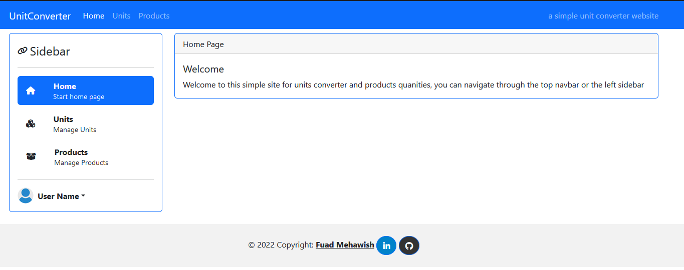
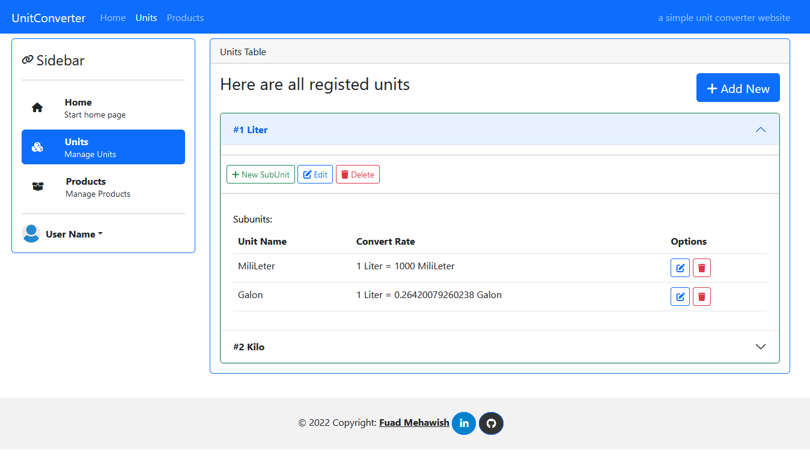
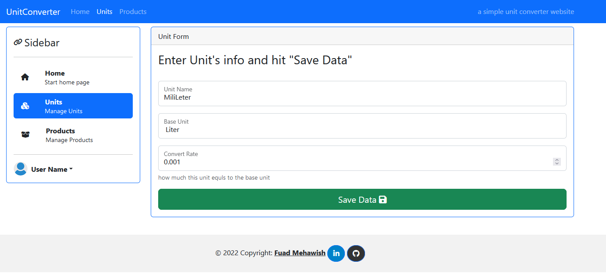
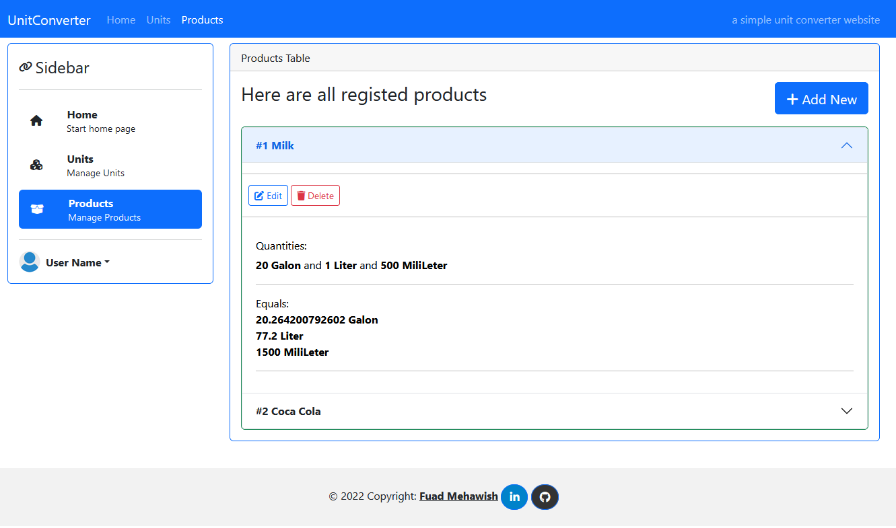
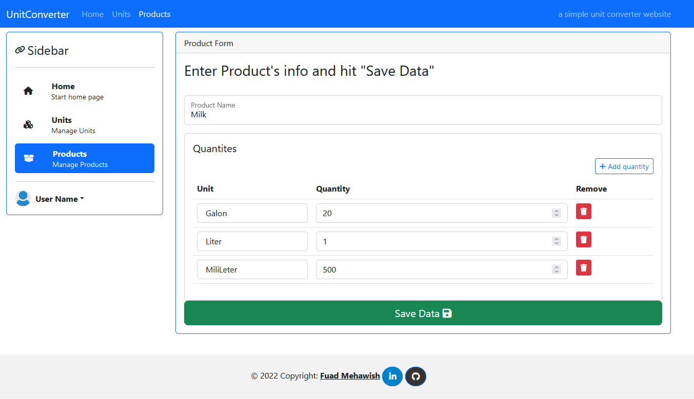
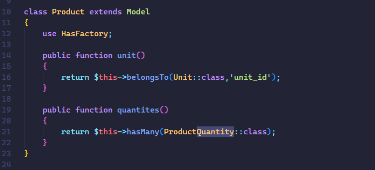
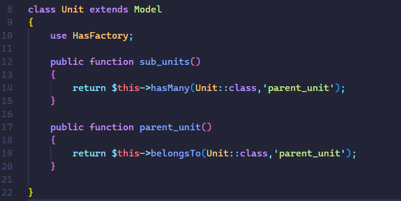
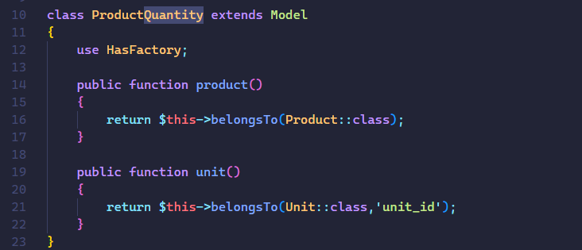

# UnitConverter
## Laravel Technical Challenge for Zcode Company

Simple Laravel, UnitConverter App

# installation
Download the content of UnitConvert <br/>
Run the command: 
```
composer install
```
to install all dependencies specified in composer.json file
then run the command 
```
php artisan migrate:fresh --seed 
```
to set the database with basic data, After setting db info on the .env file

# Screenshots

## Home Page 
<br />

## Units table
<br />

## Unit Form
<br />

## Products table
<br />

## Product Form
<br />

## Product Model
<br />

## Unit Model
<br />

## Product Quantity Model
<br />

